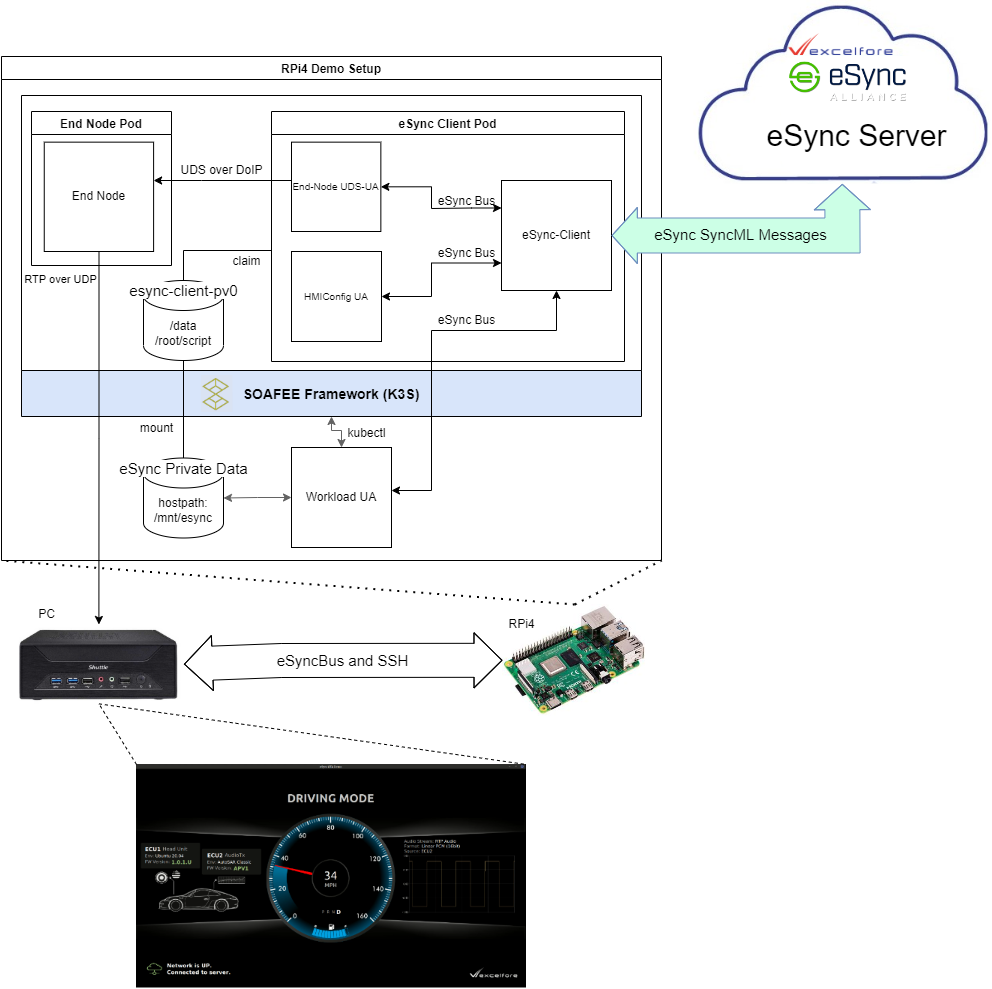

# eSync Yocto layer for EWAOL platform

## Overview

  This meta-layer will create the base image eSync in EWAOL platform.  
  This is base on the following SOAFEE Framework demo.

  

## Build Environment Setup

  1. Install Yocto Build Dependencies

      ```bash
      $ sudo apt-get update
      $ sudo apt install -y \
          gawk wget git-core diffstat unzip texinfo gcc-multilib build-essential \
          chrpath socat cpio python python3 python3-pip python3-pexpect \
          xz-utils debianutils iputils-ping python3-git python3-jinja2 \
          libegl1-mesa libsdl1.2-dev pylint3 xterm python3-subunit \
          mesa-common-dev curl parted dosfstools mtools libssl-dev git-lfs
      ```

  2. Install repo tool on the system's bin folder

      ```bash
      $ sudo curl -o /usr/local/bin/repo \
        https://storage.googleapis.com/git-repo-downloads/repo \
        && chmod a+x /usr/local/bin/repo
      ```

  3. Install [Kas](https://github.com/siemens/kas) and [bmap-tools](https://github.com/intel/bmap-tools).

      ```bash
      $ sudo pip3 install kas
      $ sudo apt-get update && sudo apt-get install -y bmap-tools
      ```

## Building RPi4 EWOAL Machine Image

  1. Clone the [meta-ewaol-machine](https://github.com/m5p3nc3r/meta-ewaol-machine)

      ```bash
      $ git clone https://github.com/m5p3nc3r/meta-ewaol-machine.git -b kirkstone-dev
      $ cd meta-ewaol-machine/
      ```

  2. Create a kas yml file `kas/machine/rpi4-eSync.yml` with the following content:

      ```yml
      header:
        version: 11

      machine: raspberrypi4-64

      repos:
        meta-raspberrypi:
          url: https://github.com/agherzan/meta-raspberrypi.git
          refspec: kirkstone
          path: layers/meta-raspberrypi
        meta-ewaol-esync:
          url: https://github.com/esync-alliance/meta-ewaol-esync.git
          refspec: main
          path: layers/meta-ewaol-esync

      local_conf_header:
        meta-raspberrypi: |
          # Always nice to have a serial console available :¬)
          ENABLE_UART = "1"
          RPI_EXTRA_CONFIG += "\ndtoverlay=disable-bt"

          # Hijack the CMDLINE_DEBUG to get the k3s cmdline requirements enabled
          # We could really do with an upstream friendly way of doing this.
          CMDLINE_DEBUG += " cgroup_memory=1 cgroup_enable=memory"

          # k3s needs br_netfilter for DNS to work from containers
          IMAGE_INSTALL:append = " kernel-module-br-netfilter"
        meta-ewaol-esync: |
          # Set eSync Auto Provision Settings
          PROVISION_API_KEY = "<eSync Server API Key>"
          PROVISION_SECRET = "<eSync Server Secret Key>"
          PROVISION_DOMAIN = "<eSync Server Provision Domain>"
          PROVISION_TOOLS_DIR = "/mnt/esync/data/tools"
          ESYNC_CLIENT_PRIV_HOST_DIR = "/mnt/esync"

          # Set eSync workload agent settings
          RPI_IP_ADDR="<IP address>"

          # Install eSync components needed for the demo
          IMAGE_INSTALL:append = " esync-k3s-deployment esync-workload-agent resize-helper sshkey-init-helper"
      ```

      * Where:
        + `esync-k3s-deployment`
          - Service that deploys esync-client and end-node container to SOAFEE framework (k3s server) on first boot.
          - Dependencies:
            + `esync-macaddr-monitor`
              - Installs the service that monitors Host MAC address that is needed for auto provisioning of DMTree and In-Vehicle Component Certificates.
        + `esync-workload-agent`
          - Service that runs the Workload Agent that updates the containers in the k3s cluster.
          - Dependencies:
            + `esync-bus`, `esync-ua`
              - eSync-Bus and UA libraries needed by an eSync Update Agent (UA).
            + `python-libua`
              - eSync Update Agent Python Bindings.
            + `esync-wa`
              - python based update agent that uses python-libua and customized to function as **Workload Agent**.
        + `resize-helper`
          - Service that auto resize rootfs on first boot to use the entire sd-card space.
        + `sshkey-init-helper`
          - Service that deploys the ssh keys and update the authorized keys data of esync-k3s-deployment.
        + `PROVISION_API_KEY`, `PROVISION_SECRET`, `PROVISION_DOMAIN`
          - Auto Provision Setting for a specific eSync Server
          - Use the following for [SOAFEE eSync Demo Server](https://soafee-esync-demo.excelfore.com/sotauiv4/#/login).

              ```bash
              PROVISION_API_KEY = "1675a931c54fba304f41edbcc98eb8614d601a450430f0504b02a7dc86e84c59"
              PROVISION_SECRET = "e2b59199e760c078845f33f2fc481669f090fd434ea388090bf6bac62e0a9ba7"
              PROVISION_DOMAIN = "https://dmprovision-alliance.excelfore.com"
              ```
        + `RPI_IP_ADDR` **(Optional)**
            - IPv4 address of the RPI4 device
            - If not provided defaults to localhost (i.e. 127.0.0.1)
  3. Checkout yocto repo using kas.

      ```bash
      $ ./build.sh rpi4-eSync baremetal checkout
      ```
  4. For security purposes, the contents of the following file is not committed, user should update them manually as discussed below.
      * [recipes-services/esync-k3s-deployment/files/docker-priv/config.json](recipes-services/esync-k3s-deployment/files/docker-priv/config.json)

        ```bash
        $ docker login gitlab.excelfore.com:4444 #Login to our private repo
        $ docker login #Login to official DockerHub
        $ cat ~/.docker/config.json
        {
                "auths": {
                        "gitlab.excelfore.com:4444": {
                                "auth": "<base64 hash>"
                        },
                        "https://index.docker.io/v1/": {
                                "auth": "<base 64 hash>"
                        }
                }
        }
        $ cd layers/meta-ewaol-esync
        $ cp ~/.docker/config.json recipes-services/esync-k3s-deployment/files/docker-priv/config.json
        ```
      * [recipes-services/esync-k3s-deployment/files/ssh-priv/authorized_keys](recipes-services/esync-k3s-deployment/files/ssh-priv/authorized_keys)

        ```bash
        $ cd layers/meta-ewaol-esync
        $ echo "<ssh-rsa pub key>" >> recipes-services/esync-k3s-deployment/files/ssh-priv/authorized_keys
        ```
  5. Start yocto build using kas:

      ```bash
      $ ./build.sh rpi4-eSync baremetal
      ```
  6. After build finishes, flash the image to sdcard as follows:

      ```bash
      $ sudo bmaptool copy build/rpi4-eSync/tmp_baremetal/deploy/images/raspberrypi4-64/ewaol-baremetal-image-raspberrypi4-64.wic.bz2 /dev/sdc
      ```
      * Note:
        + Make sure that `/dev/sdX` is the char device for your sd-card.
        + After booting up the RPI, it will take around 20mins to deploy the pods. This is only during the first bootup.
        + It is recommended to use an UHS Speed Class 3 (U3) or faster SD card to improve the pod deployment performance.

